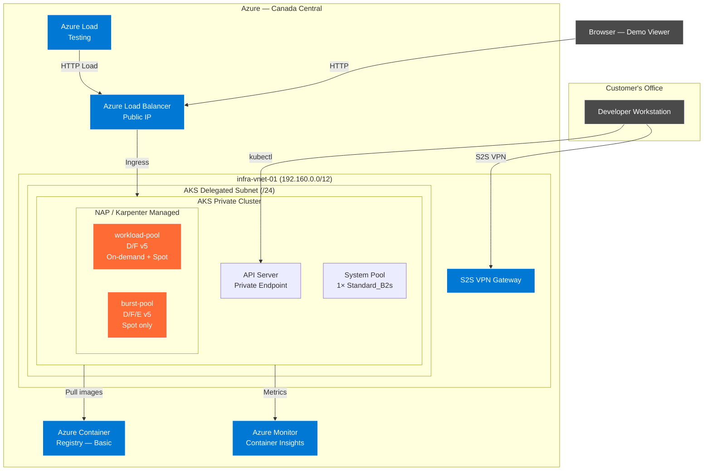
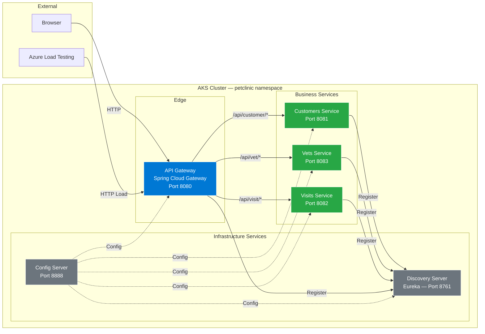
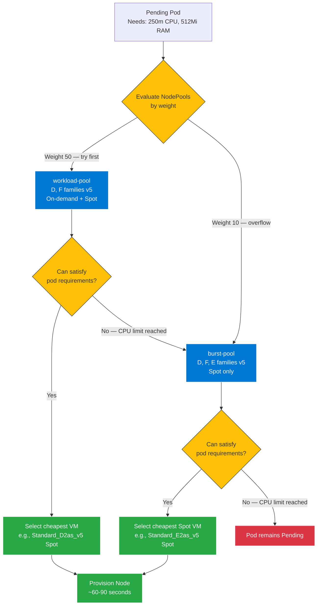

# Architecture — AKS PoC with Karpenter (NAP)

## Network Topology



## Application Architecture



## Scaling Chain — KEDA → HPA → Karpenter

```mermaid
sequenceDiagram
    participant ALT as Azure Load Testing
    participant APP as API Gateway / Services
    participant KEDA as KEDA Operator
    participant HPA as HPA (managed by KEDA)
    participant SCHED as K8s Scheduler
    participant KARP as Karpenter (NAP)
    participant AZURE as Azure Compute

    Note over ALT,AZURE: Phase 1 — Load Increases
    ALT->>APP: 250 concurrent HTTP requests
    APP->>APP: CPU rises above 50%

    Note over KEDA,HPA: Phase 2 — Pod Scaling
    KEDA->>KEDA: Detect trigger threshold exceeded
    KEDA->>HPA: Update desired replicas (1→3)
    HPA->>SCHED: Create 2 new pod replicas

    Note over SCHED,KARP: Phase 3 — Node Scaling
    SCHED->>SCHED: Cannot place pods (nodes full)
    SCHED-->>KARP: Pods in Pending state
    KARP->>KARP: Evaluate NodePools by weight
    KARP->>KARP: Select cheapest VM (workload-pool first)
    KARP->>AZURE: Provision Standard_D2s_v5 (Spot)
    AZURE-->>KARP: Node Ready (~90s)
    SCHED->>APP: Schedule pending pods on new node

    Note over ALT,AZURE: Phase 4 — Load Decreases
    ALT->>ALT: Test ends
    APP->>APP: CPU drops below threshold
    KEDA->>HPA: Update desired replicas (3→1)
    HPA->>SCHED: Terminate excess pods
    KARP->>KARP: Detect underutilized node
    KARP->>AZURE: Drain and terminate node
```

## Karpenter NodePool Priority


